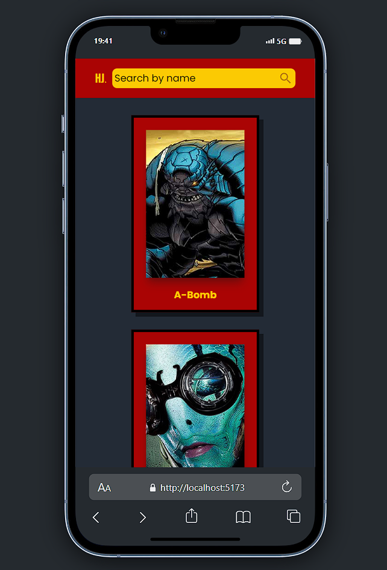
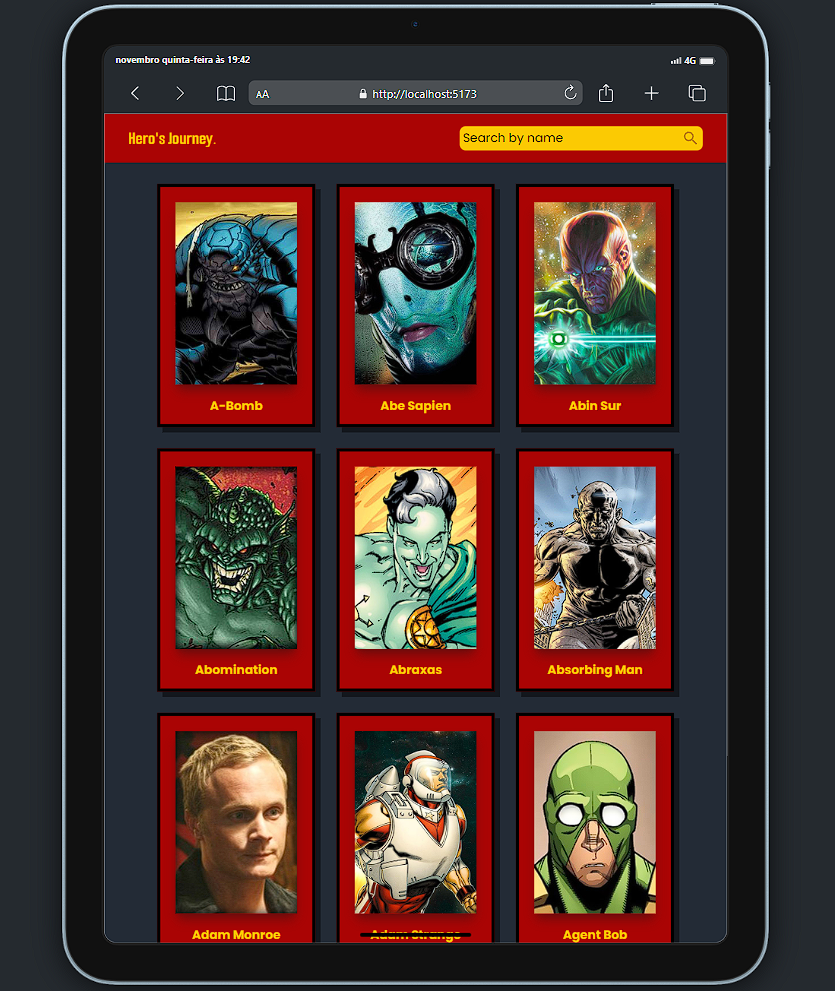
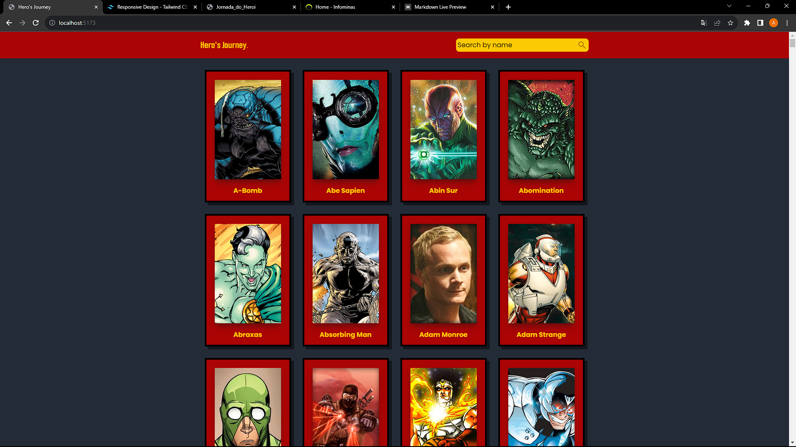

# Hero's Journey

Essa é uma solução para o teste full stack da [Infominas](https://infominas.net/
).

## Índice

- [Visão geral](#visão-geral)
- [O teste](#o-teste)
    - [O que desenvolver?](#o-que-desenvolver-?)
    - [Requisitos](#requisitos)
- [Como rodar](#como-rodar)
- [Premissas assumidas](#premissas-assumidas)
- [Outras informações importantes](#outras-informações-importantes)
- [Author](#author)

## Visão geral

### O teste

Queremos convidá-lo a fazer parte desta jornada de transformação. Nosso desafio é
simples: desenvolver uma aplicação web que abrace a temática de heróis e, ao mesmo tempo, seja a plataforma perfeita para você demonstrar todo o seu talento em desenvolvimento frontend e criatividade.

#### O que desenvolver ?
- [x] Listagem de heróis
- [x] Filtro de heróis 
- [x] Sistema de combate

#### Requisitos

- [x] Desenvolver a aplicação em ReactJS : O app foi desenvolvido em react.
- [x] Utilizar alguma biblioteca de componentes UI (Material-UI, etc): Utilizei a biblioteca MaterialUI para adicionar um icon de "lupa" no input de busca.
- [x] Implementar algum gerenciamento de estado global (React Context, Redux ou Zustand): Utilizei o React Context para acessar o estado do input de busca de qualquer lugar do aplicativo.
- [x] Estilização com um ou mais métodos (TailwindCSS, CSS, CSS-Module, CSS-in-JS): Utilizei css puro para fazer o layout "default" e o tailwindCSS para estilização de todo o app.


### Como rodar

Clone o repositório e instale as dependências:

Front-end 🖌️

```bash
cd Hero-s-Journey/frontend
npm install
npm run dev
```

### Premissas Assumidas:

- Os usuários terão uma conexão de internet estável.
- Os usuários terão node.js/npm instalados na máquina.
- O sistema é projetado para funcionar em navegadores modernos, como Chrome, Firefox e Edge.

### Outras Informações Importantes:

O layout desse aplicativo é totalmente responsivo e pode ser acessado de qualquer dispositivo.





## Author 🖋️

- linkedin - [Andressa Viana](https://www.linkedin.com/in/andressavbatista/)
- github - [Andressa Viana](https://github.com/andressavianab)